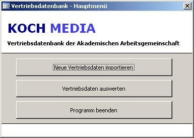
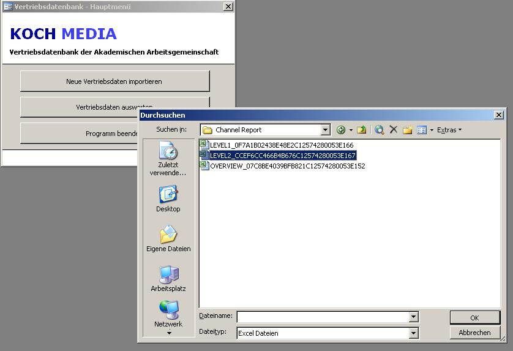
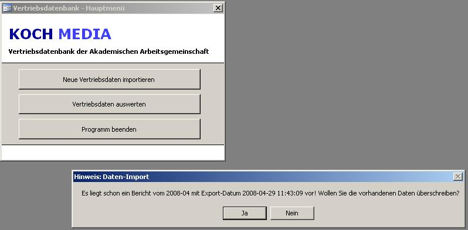
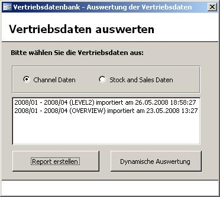
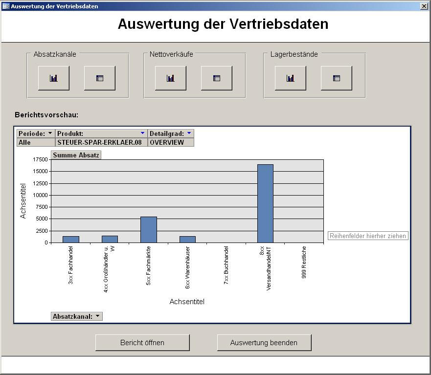
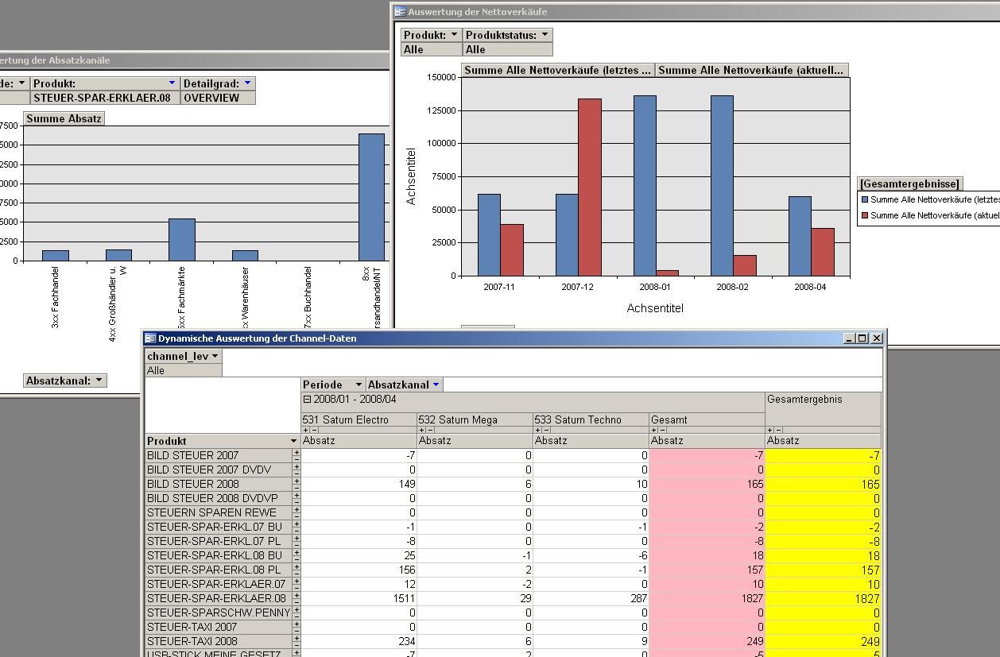
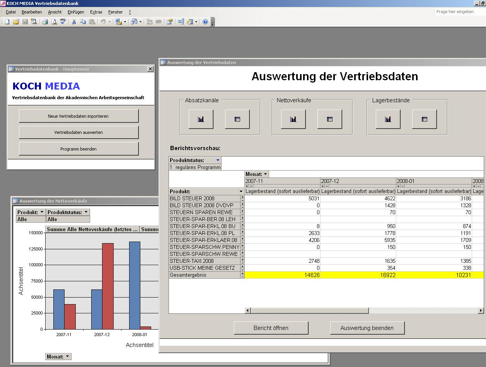
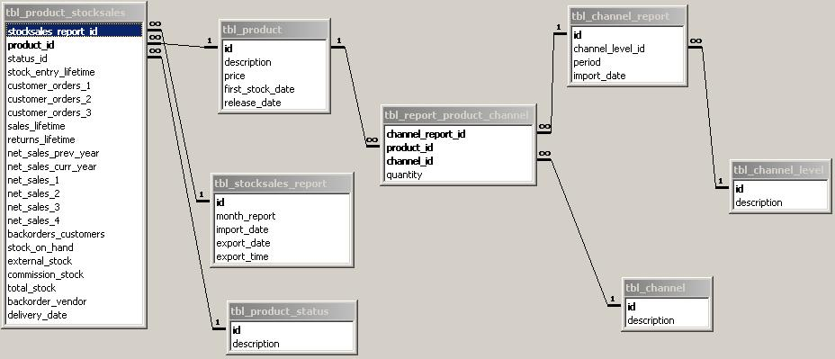
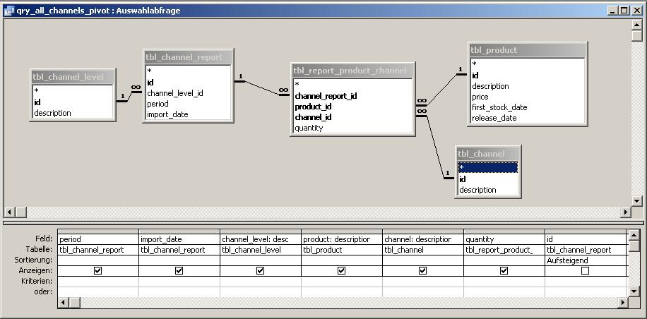
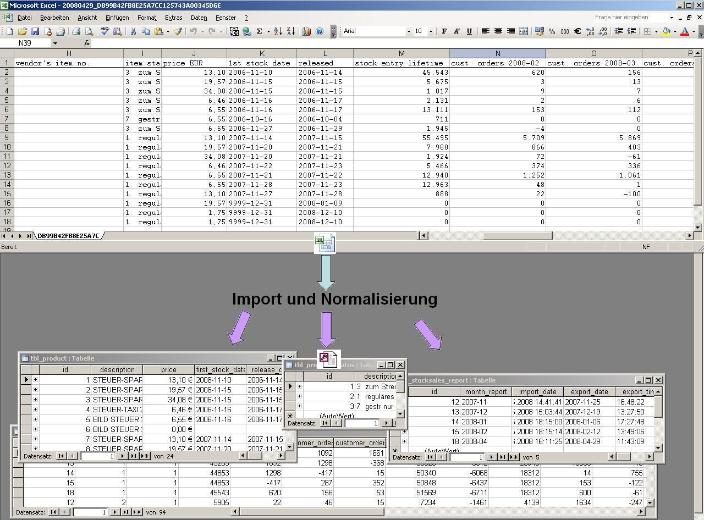

# IHK-Projekt-Vertriebsdatenbank
IHK-Projekt Vertriebsdatenbank - Ausbildung zum Informatikkaufmann 2005-2008

Projektbezeichnung: Aufbau einer Vertriebsdatenbank mit Importschnittstelle, flexiblem Auswertungs-/Analysetool und aussagefähigen Reports.

Hinweis: Aus datenschutzrechtlichen Gründen sind nicht alle projektrelevanten Informationen in diesem Repository öffentlich.
